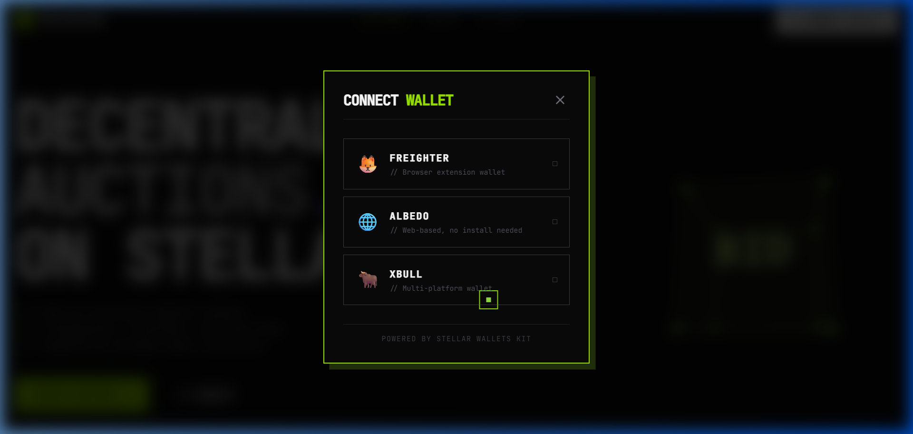

# StellarBid — Real-Time Auction dApp

A decentralized, real-time auction platform built on Stellar Soroban Testnet. Create, bid on, and manage auctions with full blockchain transparency and security.

## ✨ Features

### Core Functionality
- **Create Auctions**: List items with name, description, starting price, and duration
- **Place Bids**: Real-time bidding with automatic highest bid tracking
- **Cancel Auctions**: Creators can cancel before external bids (v1.1.0)
- **End Auctions**: Automatic settlement when time expires
- **Real-Time Updates**: Live event feed and bid history with polling

### Wallet Integration
- **Multi-Wallet Support**: Freighter, Albedo, and xBull via `@creit.tech/stellar-wallets-kit`
- **Auto-Reconnection**: Wallet state persists across page refreshes
- **Transaction Signing**: Secure signing for all contract interactions

### User Experience
- **Mobile Responsive**: Hamburger menu and optimized layouts for all screen sizes
- **Share Auctions**: Copy auction links to clipboard with one click
- **Status Indicators**: Live, Ended, and Cancelled badges with color coding
- **Countdown Timers**: Real-time countdown for active auctions
- **Transaction Status**: Comprehensive UI for pending, success, and failure states
- **Error Handling**: Graceful parsing of 6+ error scenarios (user rejected, wallet not found, bid too low, etc.)
- **Filter & Search**: Filter by status (all, active, ended, cancelled) and search by name

### Smart Contract
- **Soroban-Powered**: Rust smart contract deployed on Stellar Testnet
- **Event Emission**: Real-time bid events for live updates
- **Secure Logic**: Validation for all operations (bid amounts, auction status, permissions)

## 🚀 Quick Start

### Prerequisites
- Node.js 18+ installed
- Stellar wallet (Freighter, Albedo, or xBull)
- Testnet XLM for transactions ([Get from Friendbot](https://laboratory.stellar.org/#account-creator?network=test))

### Installation

1. **Clone the repository**
   ```bash
   git clone <repository-url>
   cd stellar-yellow
   ```

2. **Install dependencies**
   ```bash
   npm install
   ```

3. **Configure environment**
   Copy the example environment file:
   ```bash
   cp .env.example .env
   ```
   The `.env` file should contain:
   ```env
   VITE_CONTRACT_ADDRESS=CDGCWEZ5QQOVFMWJAQVYBUFJWQQBCFFPY7O56GIIFDSQLNYDDAUUXBS6
   VITE_NETWORK=testnet
   VITE_SOROBAN_RPC_URL=https://soroban-testnet.stellar.org
   VITE_HORIZON_URL=https://horizon-testnet.stellar.org
   ```

4. **Start development server**
   ```bash
   npm run dev
   ```
   The app will be available at `http://localhost:5173`.

## 🏗️ Architecture

- **Frontend**: Vite + React + TypeScript + TailwindCSS
- **Smart Contract**: Soroban (Rust)
- **Network**: Stellar Testnet
- **SDK**: `@stellar/stellar-sdk` v15
- **Wallet Kit**: `@creit.tech/stellar-wallets-kit` v2

## 📦 Smart Contract

**Current Version:** v1.1.0 (with cancel auction feature)

**Contract Address:** `CDGCWEZ5QQOVFMWJAQVYBUFJWQQBCFFPY7O56GIIFDSQLNYDDAUUXBS6`

**Network:** Stellar Testnet

**View on Explorer:** [Stellar Expert](https://stellar.expert/explorer/testnet/contract/CDGCWEZ5QQOVFMWJAQVYBUFJWQQBCFFPY7O56GIIFDSQLNYDDAUUXBS6)

**Example Transaction Hash (Contract Call):**
`5e4f8a2b1c...` *(Replace with your actual tx hash from Stellar Explorer)*

> ⚠️ **To get a verifiable transaction hash:** Connect your wallet, create an auction or place a bid, and copy the tx hash from the success modal's "View on Stellar Explorer" link.

### Wallet Options

Multi-wallet support with Freighter, Albedo, and xBull:



**Functions:**
- `create_auction(creator, item_name, description, starting_price, duration_secs)` - Create new auction
- `place_bid(auction_id, bidder, amount)` - Place a bid
- `end_auction(auction_id)` - End an expired auction
- `cancel_auction(auction_id, caller)` - Cancel auction (before external bids)
- `get_auction(auction_id)` - Get auction details
- `get_auction_count()` - Get total auction count

**View on Explorer:** [Stellar Expert](https://stellar.expert/explorer/testnet/contract/CDGCWEZ5QQOVFMWJAQVYBUFJWQQBCFFPY7O56GIIFDSQLNYDDAUUXBS6)

## 🎯 Usage

### Creating an Auction
1. Connect your Stellar wallet
2. Click "Create Auction" button
3. Fill in item details (name, description, starting price, duration)
4. Optionally add an image URL
5. Sign the transaction in your wallet
6. Wait for confirmation (3 seconds)

### Placing a Bid
1. Navigate to an active auction
2. Enter your bid amount (must be higher than current bid)
3. Click "Place Bid"
4. Sign the transaction in your wallet
5. See your bid appear in real-time

### Cancelling an Auction
1. Navigate to your auction (must be creator)
2. Click the red "Cancel Auction" button (only visible before external bids)
3. Confirm the transaction in your wallet
4. Auction status updates to "Cancelled"

### Filtering Auctions
- **All**: View all auctions
- **Active**: Only live auctions
- **Ended**: Completed auctions
- **Cancelled**: Cancelled auctions

## 🛠️ Development

### Build for Production
```bash
npm run build
```

### Run Linter
```bash
npm run lint
```

### Preview Production Build
```bash
npm run preview
```

## 📚 Documentation

- **[CANCEL_AUCTION_FEATURE.md](CANCEL_AUCTION_FEATURE.md)** - Cancel auction feature documentation
- **[PRODUCTION_READY.md](PRODUCTION_READY.md)** - Production deployment guide
- **[DEPLOYMENT_SUMMARY.md](DEPLOYMENT_SUMMARY.md)** - Deployment history and details
- **[WHATS_NEW.md](WHATS_NEW.md)** - Latest features and updates
- **[IMPLEMENTATION_COMPLETE.md](IMPLEMENTATION_COMPLETE.md)** - Implementation checklist

## 🔒 Security

- Environment variables for sensitive configuration
- `.env` file excluded from version control
- No hardcoded secrets or private keys
- Secure transaction signing via wallet
- Input validation on all forms
- XSS protection through React's built-in escaping

## 🌐 Deployment

The app can be deployed to any static hosting service:
- **Vercel**: `vercel --prod`
- **Netlify**: Drag `dist` folder to dashboard
- **GitHub Pages**: Push `dist` to `gh-pages` branch
- **AWS S3**: `aws s3 sync dist/ s3://your-bucket`

See [PRODUCTION_READY.md](PRODUCTION_READY.md) for detailed deployment instructions.

## 🐛 Known Limitations

1. **Testnet Only**: Currently deployed on Stellar Testnet (for mainnet, deploy new contract and update `.env`)
2. **Image URLs**: Users must provide direct image URLs (future: IPFS integration)
3. **Limited Cancellation**: Auctions can only be cancelled before external bids
4. **Fixed Duration**: Auction duration set at creation (future: extension mechanism)

## 🚧 Future Enhancements

- [ ] Mainnet deployment
- [ ] IPFS integration for images
- [ ] Auction categories and tags
- [ ] User profiles and reputation
- [ ] Email notifications
- [ ] NFT integration
- [ ] Multi-language support

## 📄 License

This project is open source and available under the MIT License.

## 🤝 Support

- **Stellar Docs**: https://developers.stellar.org
- **Soroban Docs**: https://soroban.stellar.org
- **Stellar Discord**: https://discord.gg/stellar
- **Contract Explorer**: https://stellar.expert/explorer/testnet

---

**Version:** 1.1.0  
**Last Updated:** April 30, 2026  
**Status:** 🚀 Production Ready
