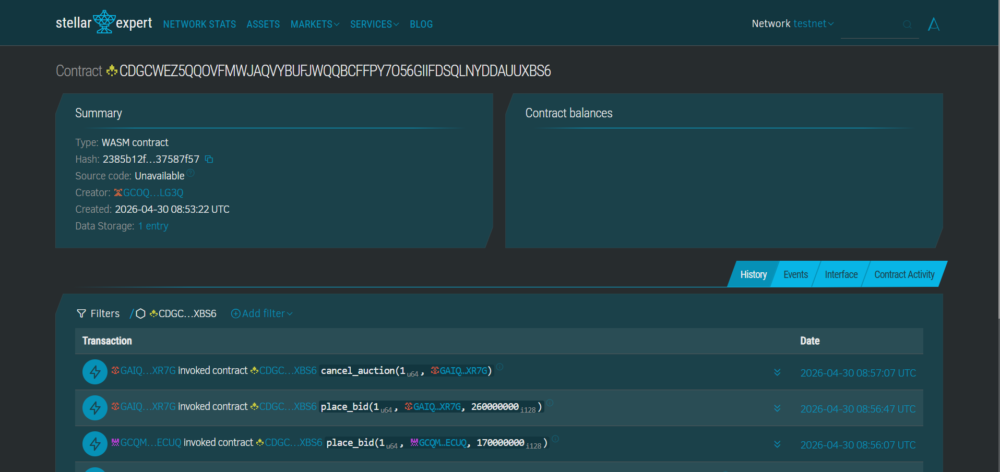
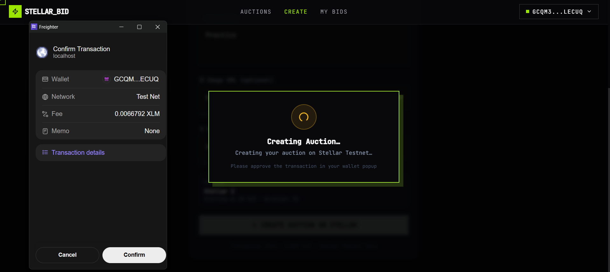

# StellarBid — Decentralized Auction Platform

A real-time, decentralized auction platform built on Stellar Soroban. Create, bid on, and manage auctions with full blockchain transparency and security.

## 🎥 Demo Video

Watch the full demo and walkthrough:

[](https://www.youtube.com/watch?v=s5cSEpsYQpM)

**[▶️ Watch on YouTube](https://www.youtube.com/watch?v=s5cSEpsYQpM)**

---

## ✨ Features

### 🎯 Core Functionality
- **Create Auctions** — List items with name, description, starting price, and duration
- **Place Bids** — Real-time bidding with automatic highest bid tracking
- **Cancel Auctions** — Creators can cancel before external bids
- **End Auctions** — Automatic settlement when time expires
- **Real-Time Updates** — Live event feed and bid history with polling

### 💼 Wallet Integration
- **Multi-Wallet Support** — Freighter, Albedo, and xBull
- **Secure Signing** — All transactions signed through your wallet
- **Direct API** — Uses native Freighter API for better reliability

### 🎨 User Experience
- **Mobile Responsive** — Optimized layouts for all screen sizes
- **Share Auctions** — Copy auction links to clipboard
- **Status Indicators** — Live, Ended, and Cancelled badges
- **Countdown Timers** — Real-time countdown for active auctions
- **Transaction Status** — Comprehensive UI for pending, success, and failure states
- **Error Handling** — Clear error messages and troubleshooting
- **Filter & Search** — Filter by status and search by name

### ⚡ Smart Contract
- **Soroban-Powered** — Rust smart contract on Stellar Testnet
- **Event Emission** — Real-time bid events for live updates
- **Secure Logic** — Validation for all operations

---

## 🚀 Quick Start

### Prerequisites
- **Node.js 18+** installed
- **Stellar Wallet** (Freighter, Albedo, or xBull)
- **Testnet XLM** ([Get from Friendbot](https://laboratory.stellar.org/#account-creator?network=test))

### Installation

1. **Clone the repository**
   ```bash
   git clone <repository-url>
   cd stellar-bid
   ```

2. **Install dependencies**
   ```bash
   npm install
   ```

3. **Configure environment**
   ```bash
   cp .env.example .env
   ```
   
   Your `.env` file should contain:
   ```env
   VITE_CONTRACT_ADDRESS=CDGCWEZ5QQOVFMWJAQVYBUFJWQQBCFFPY7O56GIIFDSQLNYDDAUUXBS6
   VITE_NETWORK=testnet
   VITE_SOROBAN_RPC_URL=https://soroban-testnet.stellar.org
   VITE_HORIZON_URL=https://horizon-testnet.stellar.org
   ```

4. **Start development server**
   ```bash
   npm run dev
   ```
   
   Open `http://localhost:5173` in your browser.

---

## 🏗️ Tech Stack

| Layer | Technology |
|-------|-----------|
| **Frontend** | Vite + React + TypeScript + TailwindCSS |
| **Smart Contract** | Soroban (Rust) |
| **Network** | Stellar Testnet |
| **SDK** | @stellar/stellar-sdk v15 |
| **Wallet Kit** | @creit.tech/stellar-wallets-kit v2 |

---

## 📦 Smart Contract

**Version:** v1.1.0 (with cancel auction feature)

**Contract Address:**  
`CDGCWEZ5QQOVFMWJAQVYBUFJWQQBCFFPY7O56GIIFDSQLNYDDAUUXBS6`

**Network:** Stellar Testnet

**Explorer:** [View on Stellar Expert](https://stellar.expert/explorer/testnet/contract/CDGCWEZ5QQOVFMWJAQVYBUFJWQQBCFFPY7O56GIIFDSQLNYDDAUUXBS6)

### Contract Verification



**Example Transaction:**  
[`9a0afc12683b267bbcdf35b207953b818e5c87cdb050ebafb0aef56620b9f1a7`](https://stellar.expert/explorer/testnet/tx/9a0afc12683b267bbcdf35b207953b818e5c87cdb050ebafb0aef56620b9f1a7)


### Available Functions

| Function | Description |
|----------|-------------|
| `create_auction` | Create a new auction |
| `place_bid` | Place a bid on an auction |
| `end_auction` | End an expired auction |
| `cancel_auction` | Cancel auction (before external bids) |
| `get_auction` | Get auction details |
| `get_auction_count` | Get total auction count |

---

## 🎯 How to Use

### 1. Connect Your Wallet


Choose from Freighter, Albedo, or xBull wallets.

### 2. Create an Auction

1. Click "Create Auction"
2. Fill in item details
3. Sign the transaction:



4. Wait for confirmation

### 3. Place Bids

1. Navigate to an active auction
2. Enter your bid amount (must be higher than current bid)
3. Sign the transaction
4. See your bid appear in real-time

### 4. Cancel an Auction

- Only available to auction creator
- Only before external bids are placed
- Click the red "Cancel Auction" button

### 5. Filter Auctions

- **All** — View all auctions
- **Active** — Only live auctions
- **Ended** — Completed auctions
- **Cancelled** — Cancelled auctions

---

## 🛠️ Development

### Build Commands

```bash
# Development server
npm run dev

# Production build
npm run build

# Preview production build
npm run preview

# Run linter
npm run lint
```

### Project Structure

```
stellar-bid/
├── src/
│   ├── components/     # React components
│   ├── contexts/       # React contexts (Wallet)
│   ├── hooks/          # Custom hooks
│   ├── lib/            # Utilities and contract client
│   ├── pages/          # Page components
│   └── main.tsx        # Entry point
├── contracts/          # Soroban smart contract (Rust)
├── public/             # Static assets
└── docs/               # Documentation images
```

---

## 🔒 Security

- ✅ Environment variables for sensitive configuration
- ✅ No hardcoded secrets or private keys
- ✅ Secure transaction signing via wallet
- ✅ Input validation on all forms
- ✅ XSS protection through React
- ✅ Direct wallet API for better security

---

## 🌐 Deployment

Deploy to any static hosting service:

| Platform | Command |
|----------|---------|
| **Vercel** | `vercel --prod` |
| **Netlify** | Drag `dist` folder to dashboard |
| **GitHub Pages** | Push `dist` to `gh-pages` branch |
| **AWS S3** | `aws s3 sync dist/ s3://your-bucket` |

### Deployment Checklist

- [ ] Update `.env` with production contract address
- [ ] Run `npm run build`
- [ ] Test the production build locally with `npm run preview`
- [ ] Deploy the `dist` folder
- [ ] Verify wallet connection works
- [ ] Test creating and bidding on auctions

---

## 🐛 Known Limitations

1. **Testnet Only** — Currently on Stellar Testnet (mainnet deployment requires new contract)
2. **Image URLs** — Users must provide direct image URLs (IPFS integration planned)
3. **Limited Cancellation** — Auctions can only be cancelled before external bids
4. **Fixed Duration** — Auction duration set at creation (extension mechanism planned)

---

## 🚧 Roadmap

### Short Term
- [ ] Mainnet deployment
- [ ] IPFS integration for images
- [ ] Auction categories and tags
- [ ] Enhanced search and filters

### Long Term
- [ ] User profiles and reputation system
- [ ] Email/push notifications
- [ ] NFT integration
- [ ] Multi-language support
- [ ] Mobile app (React Native)

---

## 📞 Support & Resources

- **Stellar Docs** — https://developers.stellar.org
- **Soroban Docs** — https://soroban.stellar.org
- **Stellar Discord** — https://discord.gg/stellar
- **Contract Explorer** — https://stellar.expert/explorer/testnet

---

## 📄 License

This project is open source and available under the MIT License.

---

## 🙏 Acknowledgments

Built with:
- [Stellar](https://stellar.org) — Blockchain platform
- [Soroban](https://soroban.stellar.org) — Smart contract platform
- [Freighter](https://freighter.app) — Stellar wallet
- [React](https://react.dev) — UI framework
- [Vite](https://vitejs.dev) — Build tool
- [TailwindCSS](https://tailwindcss.com) — Styling

---

<div align="center">

**Version:** 1.1.0  
**Status:** 🚀 Production Ready  
**Last Updated:** April 30, 2026

Made with ❤️ for the Stellar ecosystem

[⭐ Star this repo](https://github.com/your-username/stellar-bid) • [🐛 Report Bug](https://github.com/your-username/stellar-bid/issues) • [💡 Request Feature](https://github.com/your-username/stellar-bid/issues)

</div>
